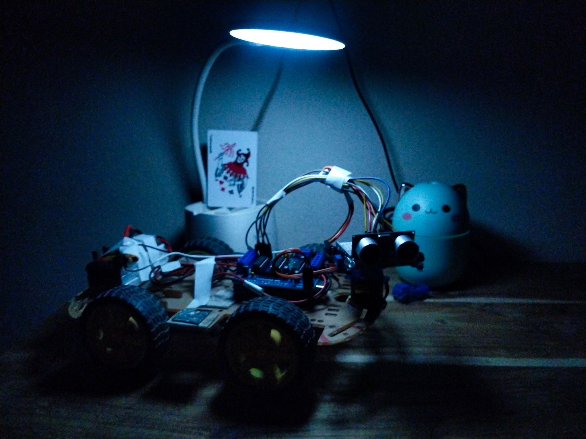

# Human Following Robot (Arduino)

This project demonstrates an Arduino-based Human Following Robot using IR sensors and an ultrasonic sensor.  
The robot detects a human presence in front of it and follows smoothly while correcting its direction using left and right IR sensors.

This repository contains the optimized Arduino code, hardware structure reference, and pin connection details.

---

## Project Overview

The robot works on a simple but effective principle:
- Ultrasonic sensor measures the distance between the robot and a human
- IR sensors determine left or right movement correction
- Motor Driver Shield controls four DC motors
- A servo motor holds the ultrasonic sensor for forward-facing detection

The logic prioritizes direction correction first and then distance-based movement to ensure smooth human following.

---

## Hardware Components

- Arduino Uno
- L293D Motor Driver Shield
- Ultrasonic Sensor (HC-SR04)
- IR Sensors (2 units)
- DC Motors (4 units)
- Servo Motor (SG90 or equivalent)
- Battery Pack (7–12V)
- Robot Chassis

---

## Robot Structure Reference

The following image shows the actual physical structure of the robot used in this project.

---

## Pin Connections

### Ultrasonic Sensor (HC-SR04)

| Sensor Pin | Arduino Pin |
|-----------|-------------|
| VCC       | 5V          |
| GND       | GND         |
| TRIG      | A1          |
| ECHO      | A0          |

---

### IR Sensors

| IR Sensor | OUT Pin | Arduino Pin |
|----------|---------|-------------|
| Left IR  | OUT     | A3          |
| Right IR | OUT     | A2          |

Both IR sensors are powered from Arduino 5V and GND.

---

### Servo Motor

| Servo Wire | Arduino Pin |
|-----------|-------------|
| Signal    | D10         |
| VCC       | 5V          |
| GND       | GND         |

---

### DC Motors (Using Motor Driver Shield)

| Motor | Shield Port |
|------|-------------|
| Motor 1 | M1 |
| Motor 2 | M2 |
| Motor 3 | M3 |
| Motor 4 | M4 |

Motor power is supplied externally using a 7–12V battery connected to the motor shield.

---

## Working Principle (Step by Step)

1. The ultrasonic sensor continuously measures the distance in front of the robot.
2. If no valid distance is detected, the robot assumes no object is nearby.
3. IR sensors check whether the detected human is slightly left or right.
4. If the human is on the left side, the robot turns left.
5. If the human is on the right side, the robot turns right.
6. If the human is centered and within the defined distance range, the robot moves forward.
7. Motor speed is adjusted based on distance to ensure smooth following.
8. If the human moves out of range, the robot stops.

---

## Software Requirements

- Arduino IDE
- AFMotor Library
- NewPing Library
- Servo Library

All libraries can be installed from the Arduino Library Manager.

---

## Upload Instructions

1. Install required libraries from Arduino Library Manager
2. Connect the Arduino Uno to your computer
3. Open the `.ino` file from this repository
4. Select the correct board and COM port
5. Upload the code

---

## License

This project is released under the MIT License.  
You are free to use, modify, and distribute this project with proper attribution.

---

## Authors Information

Original Concept: DIY Builder  
Modified and Optimized by:
**Shahriar Alom Masud**  
B.Sc. Engg. in IoT & Robotics Engineering  
University of Frontier Technology, Bangladesh  
📧 Email: shahriar0002@std.uftb.ac.bd  
🔗 LinkedIn: https://www.linkedin.com/in/shahriar-alom-masud

**Ahmed Shahariar Udoy**  
B.Sc. Engg. in IoT & Robotics Engineering  
University of Frontier Technology, Bangladesh  
📧 Email: shahariar0001@std.uftb.ac.bd  
🔗 LinkedIn: https://www.linkedin.com/in/udoy00

Year: 2024
